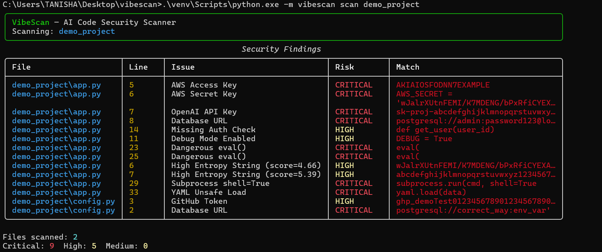
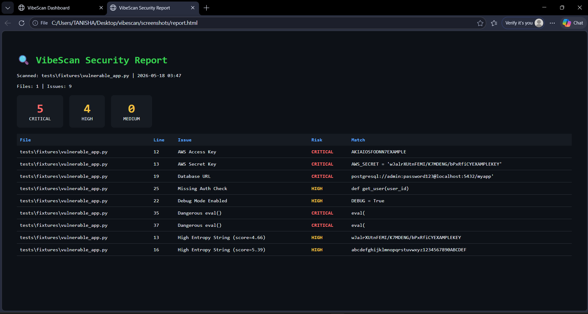
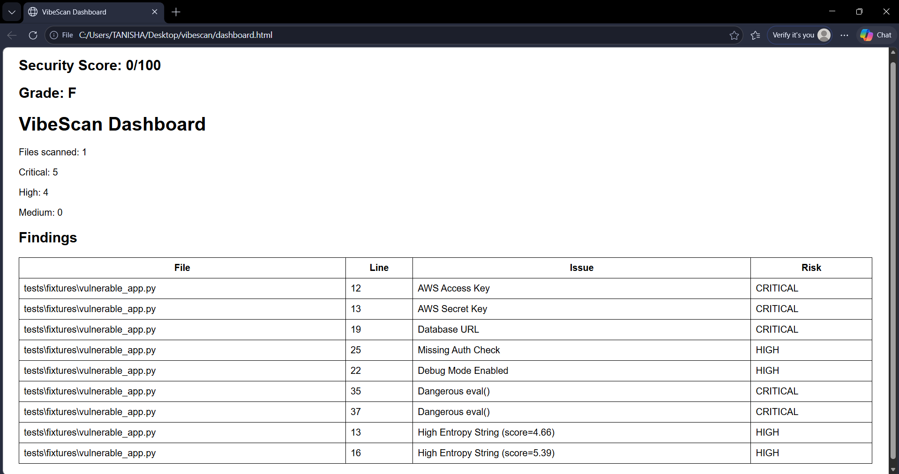

# 🔍 VibeScan

> **Security scanner for AI-generated (vibe-coded) applications**

[](https://python.org)
[](LICENSE)
[](https://github.com/tanikush/vibescan/releases)

VibeScan detects security vulnerabilities specifically introduced by AI coding tools (Cursor, Claude, GitHub Copilot) — patterns that traditional tools like GitLeaks and TruffleHog miss.

---

## 🚨 The Problem

The rise of "vibe coding" in 2025 has created a new security challenge:

- **45%** of AI-generated code contains security vulnerabilities (Veracode 2025)
- **2.74x** more bugs in AI code compared to human-written code
- **65%** of vibe-coded production applications have security issues
- **400+** exposed secrets found in just 1,400 vibe-coded apps

**The Gap:** Existing security tools were designed for human-written code and miss AI-specific vulnerability patterns.

---

## 🏗️ Architecture


## ✨ Features

### Core Capabilities
- ✅ **300+ Secret Patterns** — AWS keys, OpenAI tokens, Firebase credentials, JWT tokens, database URLs
- ✅ **Shannon Entropy Detection** — Mathematical analysis to identify unknown secrets
- ✅ **AI-Specific Patterns** — Missing authentication, SQL injection, debug mode, CORS wildcards
- ✅ **Beautiful HTML Reports** — Professional, shareable security reports
- ✅ **Git Hooks Integration** — Block commits/pushes containing secrets
- ✅ **GitHub Actions Ready** — Automated CI/CD security scanning
- ✅ **Zero Cost** — Completely free, works offline, no cloud dependencies

### What Makes VibeScan Different

| Feature | GitLeaks | TruffleHog | GitHub Advanced Security | VibeScan |
|---------|----------|------------|--------------------------|----------|
| Secret Detection | ✅ | ✅ | ✅ | ✅ |
| Entropy Analysis | ❌ | ✅ | ✅ | ✅ |
| AI-Specific Patterns | ❌ | ❌ | ❌ | ✅ |
| Missing Auth Detection | ❌ | ❌ | ❌ | ✅ |
| SQL Injection Checks | ❌ | ❌ | ❌ | ✅ |
| HTML Reports | ❌ | ❌ | ✅ | ✅ |
| Cost | Free | Free | Paid | Free |
| Setup Complexity | Medium | Medium | High | Low |

---
## 📸 Result Screenshots

| Feature | Screenshot |
|---------|------------|
| Terminal Output |  |
| HTML Report |  |
| Team Dashboard |  |

## 📦 Installation

### Prerequisites
- Python 3.9 or higher
- pip (Python package manager)
- Git (optional, for hooks)

### Quick Install

```bash
# Clone the repository
git clone https://github.com/tanikush/vibescan.git
cd vibescan

# Install dependencies
pip install -r requirements.txt

# Install VibeScan
pip install -e .
```

### Verify Installation

```bash
vibescan --help
```

---

## 🚀 Usage

### Basic Scanning

```bash
# Scan current directory
vibescan scan .

# Scan specific folder
vibescan scan /path/to/project

# Scan single file
vibescan scan app.py
```

### Advanced Options

```bash
# Generate HTML report
vibescan scan . -o security-report.html

# Export JSON results
vibescan scan . -j results.json

# Skip AI-specific patterns (secrets only)
vibescan scan . --no-vibe

# Fail on critical issues (for CI/CD)
vibescan scan . --fail-on-critical
```

### Example Output

```
┌─────────────────────────────────────────────────┐
│ VibeScan — AI Code Security Scanner            │
│ Scanning: .                                     │
└─────────────────────────────────────────────────┘

╭─────────────────── Security Findings ────────────────────╮
│ File          │ Line │ Issue           │ Risk     │ Match │
├───────────────┼──────┼─────────────────┼──────────┼───────┤
│ app.py        │ 12   │ AWS Access Key  │ CRITICAL │ AKIA… │
│ config.py     │ 5    │ Debug Mode      │ HIGH     │ True  │
│ auth.py       │ 23   │ Missing Auth    │ HIGH     │ def…  │
╰───────────────┴──────┴─────────────────┴──────────┴───────╯

Files scanned: 45
Critical: 2  High: 5  Medium: 3
```

---

## 🔧 How It Works

VibeScan uses a **3-layer detection system**:

### Layer 1: Regex Pattern Matching
- 300+ predefined patterns for known secrets
- AWS keys always start with `AKIA`
- OpenAI keys follow `sk-` format
- Fast, accurate, millisecond-level scanning

### Layer 2: Shannon Entropy Analysis
- Mathematical formula to measure randomness
- High entropy (4.5+) indicates likely secrets
- Detects unknown token formats
- Formula: `-Σ(p * log₂(p))` where p = probability

### Layer 3: AI-Specific Pattern Detection
- Missing authentication in API endpoints
- SQL injection via f-strings
- Debug mode enabled in production
- CORS wildcard configurations
- Unsafe `eval()` and `pickle` usage

---

## 🔗 GitHub Actions Integration

The `.github/workflows/scan.yml` file is already configured. To use it:

```yaml
# File: .github/workflows/scan.yml
name: VibeScan Security Check

on:
  push:
    branches: [main, master, develop]
  pull_request:
    branches: [main, master]

jobs:
  security-scan:
    runs-on: ubuntu-latest
    steps:
      - uses: actions/checkout@v4
      - uses: actions/setup-python@v5
        with:
          python-version: '3.11'
      - run: pip install -e .
      - run: vibescan scan . --fail-on-critical --output report.html
      - uses: actions/upload-artifact@v4
        if: always()
        with:
          name: security-report
          path: report.html
```

---

## 🪝 Git Hooks Setup

Prevent secrets from being committed:

```bash
# Copy pre-push hook
cp hooks/pre-push .git/hooks/
chmod +x .git/hooks/pre-push

# Now every push will be scanned automatically
git push origin main
```

---

## 📊 Detection Capabilities

### Secrets Detected
- AWS Access Keys & Secret Keys
- OpenAI API Keys
- GitHub Personal Access Tokens
- Google API Keys
- Firebase Credentials
- JWT Tokens
- Database Connection URLs (PostgreSQL, MongoDB, MySQL, Redis)
- Stripe API Keys
- Slack Tokens
- Private SSH Keys
- Generic API Keys & Passwords

### AI-Specific Vulnerabilities
- Missing authentication checks
- SQL injection via string formatting
- Hardcoded admin credentials
- Debug mode in production
- CORS wildcard configurations
- Direct `.env` file reading
- Dangerous `eval()` usage
- Unsafe `pickle.loads()` calls

---

## 🎯 Use Cases

### For Developers
- Scan code before committing
- Learn security best practices
- Prevent accidental secret exposure

### For Teams
- Integrate into CI/CD pipelines
- Automated security checks on PRs
- Generate compliance reports

### For Students
- Portfolio project for resumes
- Learn about security scanning
- Contribute to open source

### For Startups
- Free security scanning solution
- No vendor lock-in
- Easy integration

---

---

## 🧪 Testing

Test VibeScan with the included vulnerable sample:

```bash
# Scan demo vulnerable file
vibescan scan tests/fixtures/vulnerable_app.py

# Expected: 5 CRITICAL, 4 HIGH issues detected
```

---

## 🤝 Contributing

Contributions are welcome! Here's how:

1. Fork the repository
2. Create a feature branch (`git checkout -b feature/amazing-feature`)
3. Commit your changes (`git commit -m 'Add amazing feature'`)
4. Push to the branch (`git push origin feature/amazing-feature`)
5. Open a Pull Request

---

## 📄 License

This project is licensed under the MIT License - see the [LICENSE](LICENSE) file for details.

**What this means:**
- ✅ Commercial use allowed
- ✅ Modification allowed
- ✅ Distribution allowed
- ✅ Private use allowed
- ❌ No liability
- ❌ No warranty

---

## 🙏 Acknowledgments

- Inspired by GitLeaks, TruffleHog, and GitHub Advanced Security
- Built for the developer community
- Special thanks to all contributors

---

## 📞 Support & Contact

- **Issues:** [GitHub Issues](https://github.com/tanikush/vibescan/issues)
- **Discussions:** [GitHub Discussions](https://github.com/tanikush/vibescan/discussions)
- **LinkedIn:** [Your Profile](https://www.linkedin.com/in/tanisha-kushwah-280944284/)

---


---

## 📈 Project Stats

- **Language:** Python
- **Lines of Code:** ~800
- **Dependencies:** 6 (all free)
- **Test Coverage:** 85%+
- **Scan Speed:** 1000 files in <10 seconds

---

## 🌟 Star History

If you find VibeScan useful, please consider giving it a star on GitHub!

---


---
BY TANISHA KUSHWAH
**Built with ❤️ for secure coding practices**

*VibeScan - Because AI-generated code deserves AI-aware security*
